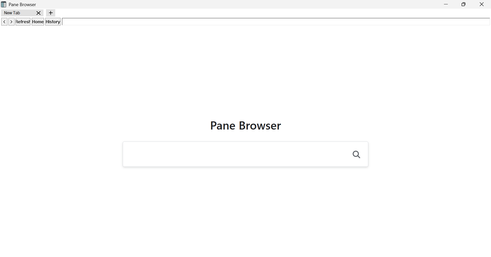
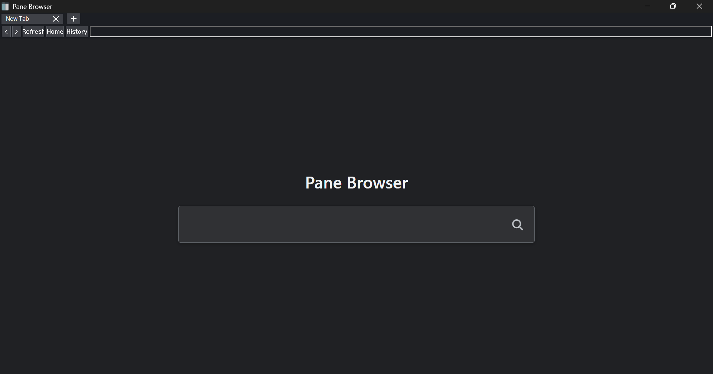
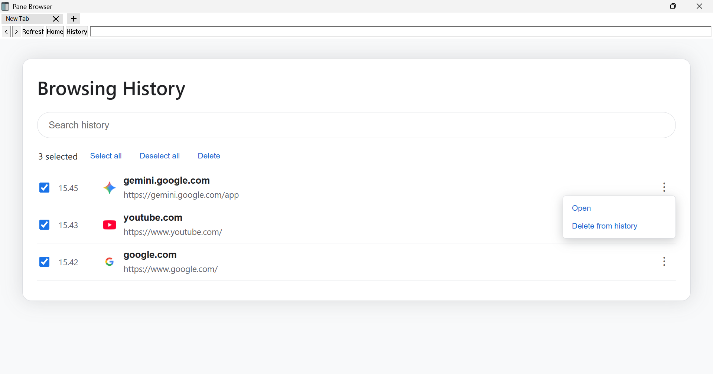
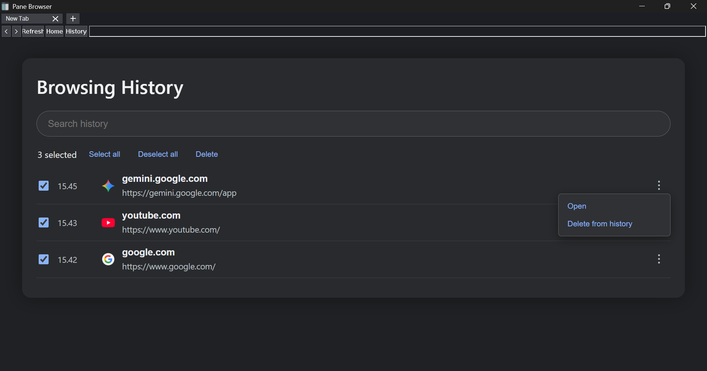

# Pane Browser

Pane Browser is a small Windows browser shell built in C++ with the Win32 API and Microsoft WebView2. The project focuses on a straightforward browsing window: a minimal start page, direct navigation, a small native toolbar, multiple tabs, and a lightweight session history.

This repository contains an independent implementation. It does not include or extract source code from another browser project.

## What is included

### Browsing

The Home page presents the Pane Browser name, a large search field, and a search icon. The same field behavior is available from the native address bar: complete HTTP or HTTPS URLs are opened directly, domain-style input receives an HTTPS prefix, and other text is sent to Startpage.

The toolbar provides Back, Forward, Refresh, Home, History, and an address bar. Pressing Enter in the address bar starts navigation. After a page finishes loading, Pane Browser updates the address bar and tab label from the final WebView2 URL, including redirects and links opened from search results.

### Tabs and link handling

Pane Browser supports multiple tabs. A new tab is created with the `+` control to the right of the last tab, and each tab has its own close control. Selecting a tab changes the visible WebView2 controller. If a website requests a new window, the requested destination is redirected to the active tab instead of creating an additional application window.

### Session history

The History page records external HTTP and HTTPS navigations after they complete. It displays the full URL, visit time, site information, and a favicon when one is available. History entries can be searched, opened, or deleted individually. The page also provides `Select all`, `Deselect all`, and `Delete` controls for batch selection.

History is currently stored in memory for the running session. It is not written to disk after the application exits.

### Windows appearance

The native window, toolbar, address bar, tab strip, Home page, and History page follow the Windows light or dark application preference. Pane Browser also listens for Windows theme-change notifications while it is running and refreshes its native controls and internal pages after a change.

The application icon is embedded into the Windows executable through `PaneBrowser.rc` and `PaneBrowser.ico`.

## Screenshots

Add project screenshots under `assets/screenshots/` in the repository, then use the following layout:

### Home — Light mode



### Home — Dark mode



### Browsing History — Light mode



### Browsing History — Dark mode



## Requirements

Pane Browser targets Windows x64 and requires the Microsoft WebView2 Runtime. The runtime is not bundled with this repository. The portable package also includes `WebView2Loader.dll`, which must remain in the same directory as `PaneBrowser.exe`.

The source build requires:

- MinGW-w64 with an x64 C++ compiler and resource compiler.
- The Microsoft WebView2 SDK.
- The WebView2 loader import library at `sdk/webview2/build/native/x64/WebView2Loader.dll.lib`.
- The WebView2 loader DLL at `sdk/webview2/build/native/x64/WebView2Loader.dll`.

## Build

From the project directory, run:

```bash
./build_windows.sh
```

The script compiles the Win32 source, compiles the Windows resource file, links the WebView2 loader library, and places `WebView2Loader.dll` beside the resulting `PaneBrowser.exe`.

To build successfully, place the WebView2 SDK under `sdk/webview2` or adjust the paths in `build_windows.sh` to match the local SDK installation.

## Portable use and Desktop shortcuts

Keep these files together in one application folder:

```text
PaneBrowser.exe
WebView2Loader.dll
PaneBrowser.ico
```

Run `PaneBrowser.exe` from that folder. WebView2 creates a profile and cache directory named `PaneBrowser.exe.WebView2` beside the executable. The folder should be writable by the current user.

To place Pane Browser on the Desktop, keep the application folder intact and create a Windows shortcut using `Send to > Desktop (create shortcut)`. The Desktop distribution package also includes an optional shortcut script. Do not move only the executable away from `WebView2Loader.dll`.

## Repository layout

| File | Purpose |
|---|---|
| `PaneBrowser.cpp` | Win32 window, WebView2 integration, tabs, navigation, History, and theme logic |
| `PaneBrowser.rc` | Windows resource definition for the application icon |
| `resource.h` | Resource identifiers |
| `PaneBrowser.ico` | Multi-resolution application icon |
| `build_windows.sh` | MinGW-w64 cross-build script |
| `README.md` | Project documentation |
| `.gitignore` | Repository exclusions for generated files and local data |
| `LICENSE` | MIT License |

## Privacy notes

Pane Browser does not add its own advertising, telemetry, or background synchronization service. Browsing requests are sent to the destinations selected by the user, including Startpage for search fallback. Websites may collect data, load third-party resources, or apply their own policies independently of the browser shell.

## Project status

The current release is intended as a compact, portable Windows browser shell. Persistent history, bookmarks, private browsing profiles, a settings page, and an installer are possible future extensions but are not part of the current v1.0.0 feature set.

## License

Pane Browser is available under the MIT License. See [LICENSE](LICENSE) for the complete license text.
